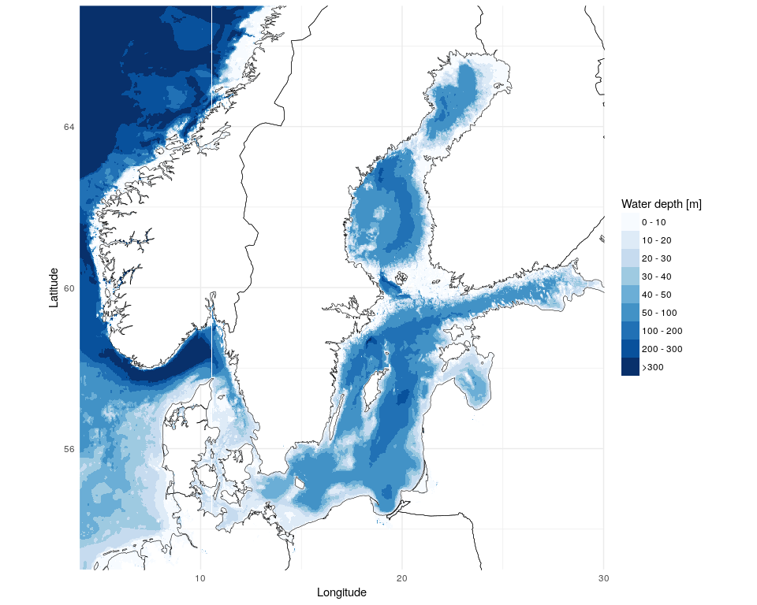
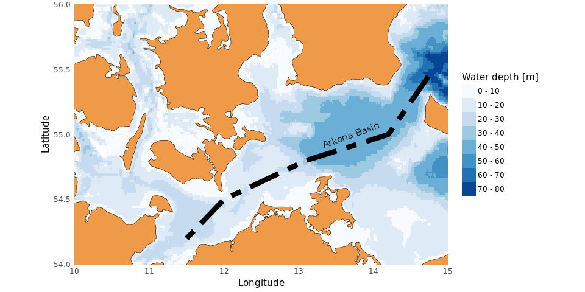
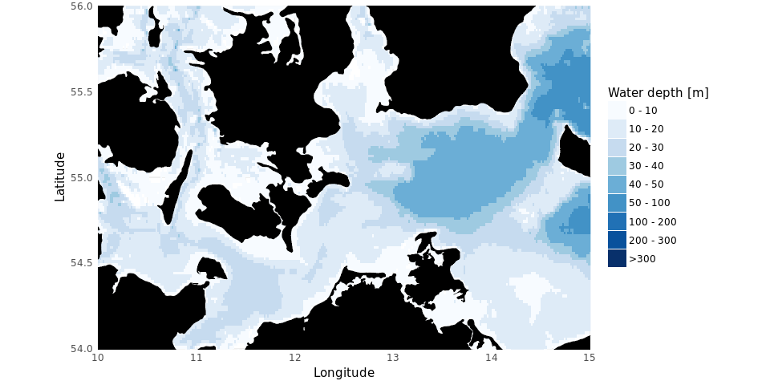
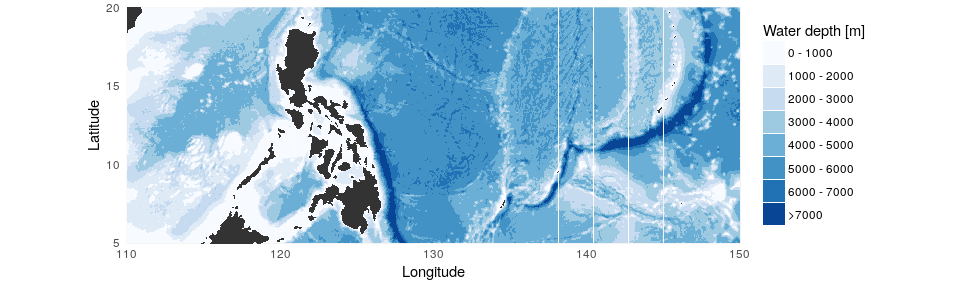

Bathymetry mapping with ggplot in R
================
Marko Lipka

### Intro

Plot bathymetry maps from Long-Lat coordinates.

required libraries:
+ marmap,
+ mapdata and
+ ggplot2

``` r
source("ggPlotBathymetry.R")
```

*plot.bathymetry()* fetches bathymetry data (*marmap* package) and coastlines (*mapdata* package) from the desired region and returns a ggplot that can be subsequently extended by further ggplot-layers.

Arguments
---------

<table>
<colgroup>
<col width="11%" />
<col width="88%" />
</colgroup>
<thead>
<tr class="header">
<th>argument</th>
<th>description</th>
</tr>
</thead>
<tbody>
<tr class="odd">
<td>lon.min, lon.max, lat.min, lat.max</td>
<td>Limits of the region to be plotted in decimal degrees</td>
</tr>
<tr class="even">
<td>bathy.breaks</td>
<td>either a numeric vector up to 9 unique cut points or a single number (up to 8) giving the number of intervals for the bathymetry plot</td>
</tr>
<tr class="odd">
<td>land.colour, border.colour</td>
<td>valid name or number specifying a color (defaults are <em>NA</em> for land.color and &quot;black&quot; for border.color)</td>
</tr>
</tbody>
</table>

### Examples

#### The Baltic Sea:

... with manually defined bathymetry break points.

``` r
plot.bathymetry(lon.min = 4, lon.max = 30,
                lat.min = 53, lat.max = 67,
                bathy.breaks = c(seq(0, 50, length.out = 6),
                                 seq(100, 300, length.out = 3),
                                 +Inf))
```

    ## File already exists ; loading 'marmap_coord_4;53;30;67_res_1.csv'



#### The southern Baltic Sea region:

... with coloured dry land and additional plot layers.

``` r
plot.bathymetry(lon.min = 10, lon.max = 15, lat.min = 54, lat.max = 56, 
                bathy.breaks = seq(0, 100, 10),
                land.colour = "tan2") +
    geom_path(data = data.frame(lat = c(54.2, 54.5, 54.8, 55, 55.5),
                                 lon = c(11.5, 12, 13.1, 14.2, 14.8)),
               mapping = aes(x = lon, y = lat),
               color = "black", size = 3, linetype = "twodash") +
    annotate(geom = "text", x = 13.7, y = 55, angle = 20,
             label = "Arkona Basin")
```

    ## File already exists ; loading 'marmap_coord_10;54;15;56_res_1.csv'



To get a plot of the southern Baltic Sea while maintaining the range of the legend for the whole Baltic Sea (see above), plot range of the 'whole Baltic Sea plot' can be limited via 'coord\_quickmap()':

``` r
plot.bathymetry(lon.min = 4, lon.max = 30,
         lat.min = 53, lat.max = 67,
         bathy.breaks = c(seq(0, 50, length.out = 6),
                                 seq(100, 300, length.out = 3),
                                 +Inf),
         land.colour = "black") +
    coord_quickmap(xlim = c(10, 15), ylim = c(54, 56))
```

    ## File already exists ; loading 'marmap_coord_4;53;30;67_res_1.csv'



#### Works for any region in the world

``` r
long <- 110
lat <- 5

plot.bathymetry(lon.min = long, lon.max = long +40, lat.min = lat, lat.max = lat + 15, 
         bathy.breaks = c(0, 1000, 2000, 3000, 4000, 5000, 6000, 7000, +Inf),
         land.colour = "grey20", border.colour = NA)
```

    ## File already exists ; loading 'marmap_coord_110;5;150;20_res_1.csv'



Known issues / \#TODO:
----------------------

-   map\_data even with *map = 'worldHires'* does not include all islands:
    -   is there another source for high resolution coastlines of the world?
    -   is the coastline necessary ?
-   would be nice to have some options for the colour scale of bathymetry
    -   continuous vs. discrete
    -   colour gradient selection
    -   more convenient labeling / interval selection
-   option for (labeled) contour lines (package 'directlabels' is no option, as the output must be a ggplot object so that layers can be added to the function output)
